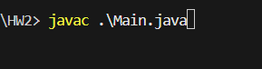
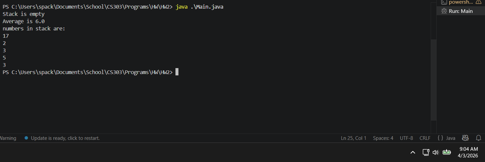

# Compile code

4/3 note: Thank you for reminding us in class to show proof of the code working, I didn't do that originally so the below was done afterwords and I will have no issue if you don't improve my grade for it.I will be sure to do it in future code (and improve my readmes with complete work and instructions, sorry).
 
